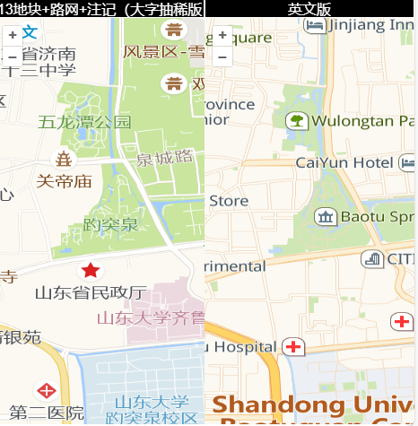

摘要：提供高德在线瓦片地图文档以及功能示例。
<!--more-->
身为 GIS 从业者，在众多项目场景里，在线地图的运用必不可少。而高德在线瓦片地图在众多地图厂商中脱颖而出，独占鳌头。其完美践行了互联网精神中的共享与开放理念，以无门槛的优势，极大地方便了从业者的使用，为行业发展提供了有力支持。 
但是，高德官网未提供相关讲解文档，为方便广大网友快速查询高德在线瓦片地图信息，笔者通过广泛收集互联网资料，精心整理出此份资料。该文档将持续更新迭代，以确保其时效性和准确性。若您有这方面的需求，不妨[收藏并关注](https://chatgis.space/)，以便随时获取最新内容。  
## 1、参数说明
示例：
`http://wprd01.is.autonavi.com/appmaptile?lang=zh_cn&size=1&style=7&x={x}&y={y}&z={z}&ltype=8`
|变量|可选项|说明|
| -- | -- | -- |
|[域名](https://chatgis.space/)|webrd、wprd、webst|wprd和webst效果一致，webrd有普通字体大小和老版本瓦片，可查看具体示例|
|子域名|01、02、03、04|建议使用`0{1-4}`格式|
|语言：lang|zh_cn、en|中文、英文|
|尺寸:scl|1、2|瓦片尺寸，1: 256×256；2：512×512，默认是1，当scl=2时不显示注记|
|style|6、7、8、9、10|不同域名规律不一致，以webrd为例，6是卫星影像，其他见具体示例|
|ltype|1、2、3、4、5、6、7、8|见具体示例|
|[size](https://chatgis.space/)|不生效|暂未找到规律|

## 2、具体示例
按照域名分类；
### 2.1、webrd系列
```
// 01标准版
http://webrd0{1-4}.is.autonavi.com/appmaptile?lang=zh_cn&size=1&scale=1&style=8&x={x}&y={y}&z={z}
// 02老版本（新地物缺失、地图泛红）
http://webrd0{1-4}.is.autonavi.com/appmaptile?lang=zh_cn&size=1&scale=1&style=7&x={x}&y={y}&z={z}
```


### 2.2、wprd、webst系列
```
// 03影像
http://wprd0{1-4}.is.autonavi.com/appmaptile?lang=zh_cn&size=1&style=6&x={x}&y={y}&z={z}
// 04大字版(注记抽稀)
http://wprd0{1-4}.is.autonavi.com/appmaptile?lang=zh_cn&size=1&style=7&x={x}&y={y}&z={z}
http://wprd0{1-4}.is.autonavi.com/appmaptile?lang=zh_cn&size=1&style=10&x={x}&y={y}&z={z}
// 05路网加注记
http://wprd0{1-4}.is.autonavi.com/appmaptile?lang=zh_cn&size=1&style=8&x={x}&y={y}&z={z}
// 06大字版(注记未抽稀、无图标)
http://wprd0{1-4}.is.autonavi.com/appmaptile?lang=zh_cn&size=1&style=9&x={x}&y={y}&z={z}
// 07只显示地块（style可以是7、8、9、10）
http://wprd0{1-4}.is.autonavi.com/appmaptile?lang=zh_cn&size=1&style=7&x={x}&y={y}&z={z}&ltype=1
// 08只显示路网
http://wprd0{1-4}.is.autonavi.com/appmaptile?lang=zh_cn&size=1&style=7&x={x}&y={y}&z={z}&ltype=2
// 09地块+路网（无注记）
http://wprd0{1-4}.is.autonavi.com/appmaptile?lang=zh_cn&size=1&style=7&x={x}&y={y}&z={z}&ltype=3
// 10只显示注记（大字抽稀版本）
http://wprd0{1-4}.is.autonavi.com/appmaptile?lang=zh_cn&size=1&style=7&x={x}&y={y}&z={z}&ltype=4
// 11地块+注记（大字抽稀版本）
http://wprd0{1-4}.is.autonavi.com/appmaptile?lang=zh_cn&size=1&style=7&x={x}&y={y}&z={z}&ltype=5
// 12路网+注记（大字抽稀版本）
http://wprd0{1-4}.is.autonavi.com/appmaptile?lang=zh_cn&size=1&style=7&x={x}&y={y}&z={z}&ltype=6
// 13地块+路网+注记（大字抽稀版本）
http://wprd0{1-4}.is.autonavi.com/appmaptile?lang=zh_cn&size=1&style=7&x={x}&y={y}&z={z}&ltype=7
// 14纯色底图
http://wprd0{1-4}.is.autonavi.com/appmaptile?lang=zh_cn&size=1&style=7&x={x}&y={y}&z={z}&ltype=8
```

## 3、效果呈现
常用效果对比展示
- 标准版&大字版
[](https://chatgis.space/)

- 影像图叠加版本


- 有无注记版本对比


- 中英文版本
