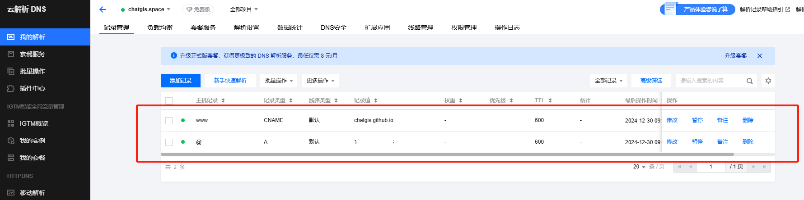
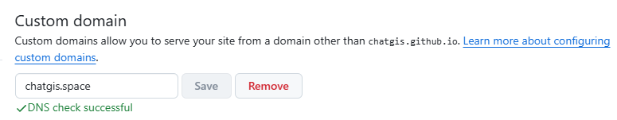
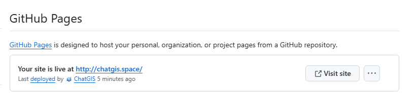

## 1. 最佳拍档
- GitHub Page
  是一项静态站点托管服务，它直接从 GitHub 上获取 HTML、CSS 和 JavaScript 文件，通过构建过程运行文件，然后发布网站，不需要购买服务器就可以实现个人博客网站，而且无需备案。
- [Hexo](https://hexo.io/zh-cn/)
  是一个快速、简洁且高效的博客框架。 Hexo 使用 Markdown（或其他标记语言）解析文章，在几秒内，即可利用靓丽的主题生成静态网页，如果擅长使用node，这个框架非常简单。
- 域名
  比`github.io`看上去更正式，另外，非`com、cn`这种顶级的域名都比较便宜。  

综上，GitHub Page + Hexo + 域名是金钱时间都非常低成本的搭配，对大多数人足够啦。毕竟，大多数人只是一时冲动，后续能够持续更新内容的博客网站很少很少。
## 2. 创建github.io库
创建github帐号、创建`[username].github.io`的库，非常简单。
## 3.本地部署Hexo
```
npm install -g hexo-cli
hexo init
npm install
hexo server
```
## 4. 部署
参考：https://hexo.io/zh-cn/docs/github-pages#%E4%B8%80%E9%94%AE%E9%83%A8%E7%BD%B2
`_config.yml`增加配置
```
deploy:
  type: git
  repo: git@github.com:ChatGIS/chatgis.github.io.git
  branch: deploy
```
 注意：repo配置项一定要使用`git`开头的ssh方式，不要使用`https`，否则，在部署时经常会报错。  


```
hexo clean
hexo generate
hexo deploy
```
## 5. 绑定域名
先买域名
### 域名解析


### 域名绑定

该过程会自动在部署的分支下面创建一个CNAME的文件，文件内容是您的域名。


上面这种方式在更新网站时会造成CNAME文件的丢失，所以需要在`/source`增加该文件，这样部署时会带上该文件。

## 6. Hexo设置博客路径
在`_config.yml`中修改配置，如下：
```
# permalink: :year/:month/:day/:title/
permalink: post/:title/index.html
```
请求路径就变成了不带有时间的啦，并且都在`post`目录下。
