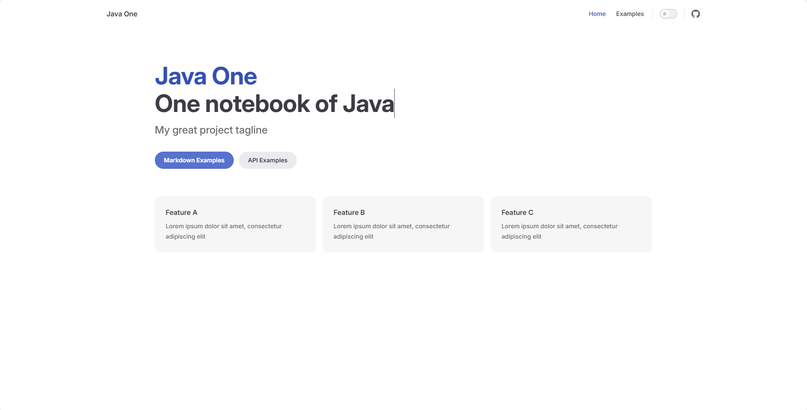

## 1. 安装
在已有文件夹安装；
```
// 切到安装文件夹
cd java-one
```

### 1.1. npm初始化
```
// 初始化
npm init
```
初始化配置内容：
```
This utility will walk you through creating a package.json file.
It only covers the most common items, and tries to guess sensible defaults.

See `npm help init` for definitive documentation on these fields
and exactly what they do.

Use `npm install <pkg>` afterwards to install a package and
save it as a dependency in the package.json file.

Press ^C at any time to quit.
package name: (java-one)
version: (1.0.0)                                       
description: One notebook of Java                         
entry point: (index.js)                              
test command:
git repository:
keywords:
author: ChatGIS                                    
license: (ISC)                                                      
About to write to E:\GitHubChatGIS\java-one\package.json:

{
  "name": "java-one",
  "version": "1.0.0",
  "description": "One notebook of Java",
  "main": "index.js",
  "devDependencies": {},
  "scripts": {
    "test": "echo \"Error: no test specified\" && exit 1"
  },
  "author": "ChatGIS",
  "license": "ISC"
}


Is this OK? (yes) yes
```

### 1.2. 安装VitePress
```
 npm add -D vitepress
```

### 1.3. 安装向导
```
npx vitepress init
```
回答几个简单问题，引导配置初始信息
```
┌  Welcome to VitePress!
│
◇  Where should VitePress initialize the config?
│  ./docs
│
◇  Site title:
│  Java One
│
◇  Site description:
│  One notebook of Java
│
◇  Theme:
│  Default Theme
│
◇  Use TypeScript for config and theme files?
│  No
│
◇  Add VitePress npm scripts to package.json?
│  Yes
│
└  Done! Now run npm run docs:dev and start writing.

Tips:
- Make sure to add  docs/.vitepress/dist and  docs/.vitepress/cache to your .gitignore file.
```

### 1.4. 增加gitignore
按照上一步的Tips，增加`.gitignore`，增加以下内容：
```
node_modules
docs/.vitepress/dist
docs/.vitepress/cache
```

## 2. 文件结构
参考[官网内容](https://vitepress.dev/zh/guide/getting-started)
> 如果正在构建一个独立的 VitePress 站点，可以在当前目录 (./) 中搭建站点。但是，如果在现有项目中与其他源代码一起安装 VitePress，建议将站点搭建在嵌套目录 (例如 ./docs) 中，以便它与项目的其余部分分开。

 由于是在已有项目中安装vitepress，所以按照建议将站点搭建在嵌套目录docs中。
```
.
├─ docs
│  ├─ .vitepress
│  │  └─ config.js
│  ├─ api-examples.md
│  ├─ markdown-examples.md
│  └─ index.md
└─ package.json
```

- docs 目录作为 VitePress 站点的项目根目录
- .vitepress 目录是 VitePress 配置文件、开发服务器缓存、构建输出和可选主题自定义代码的位置
- .vitepress 目录之外的 Markdown 文件被视为源文件。

> VitePress 使用 基于文件的路由：每个 .md 文件将在相同的路径被编译成为 .html 文件。例如，index.md 将会被编译成 index.html，可以在生成的 VitePress 站点的根路径 / 进行访问。

## 3. 启动运行
```
npm run docs:dev
```

初始页面：


## 4. 站点配置
参考[官网](https://vitepress.dev/zh/reference/site-config)
站点配置都在`config.mjs`中设置；
在默认配置基础上进行微调；
```
import { defineConfig } from 'vitepress'

// https://vitepress.dev/reference/site-config
export default defineConfig({
  title: "Java One",
  description: "One notebook of Java",
  themeConfig: {
    // https://vitepress.dev/reference/default-theme-config
    nav: [
      { text: '主页', link: '/' },
      { text: 'Java入门', link: '/java/java0101' }
    ],

    sidebar: [
      {
        text: 'Java入门教程',
        items: [
          { text: '你好, Java', link: '/java/java0101' },
          { text: 'Java基本语法', link: '/java/java0201' },
        ]
      }
    ],

    socialLinks: [
      { icon: 'github', link: 'https://github.com/ChatGIS/java-one' }
    ]
  }
})
```

## 5. 布局

有 3 种布局选项 doc、page 和 home。默认是home，也就是主页的样式，如步骤3截图。
其实，我这个项目不需要主页，直接展示具体文章内容即可，所以将布局调整为doc，调整位置在`index.md`中。
```
layout: doc
```
由于，hero、features是home布局的属性，所以当前doc布局就不需要这些属性了。

如果只设置上面代码，进入站点的默认主页是空白的，看上去体验不好，所以可以增加一段文字描述。
使用markdown语法，在下面继续编写即可，只要不在两个分隔符 `---`内部即可。
```
---
layout: doc
---
## Java One
Java One (Java集、Java一本书)，用于个人整理Java相关的学习内容，包括文章以及源码。
```

## 6. 部署到github
参考[官网](https://vitepress.dev/zh/guide/deploy)
### 6.1. 配置base
> 设定 public 根目录
默认情况下，我们假设站点将部署在域名 (/) 的根路径上。如果站点在子路径中提供服务，例如 https://mywebsite.com/blog/，则需要在 VitePress 配置中将 base 选项设置为 '/blog/'。
例：如果你使用的是 Github（或 GitLab）页面并部署到 user.github.io/repo/，请将 base 设置为 /repo/。

```
base: '/java-one/',
```

### 6.2. 配置部署工作流
在项目根目录创建` .github/workflows` 目录，在新建目录中创建一个名为 deploy.yml 的文件。
```
# 构建 VitePress 站点并将其部署到 GitHub Pages 的示例工作流程
#
name: Publish Action

on:
  # 在针对 `main` 分支的推送上运行。如果你
  # 使用 `master` 分支作为默认分支，请将其更改为 `master`
#   push:
#     branches: [main]

  # 允许你从 Actions 选项卡手动运行此工作流程
  workflow_dispatch:

# 设置 GITHUB_TOKEN 的权限，以允许部署到 GitHub Pages
permissions:
  contents: read
  pages: write
  id-token: write

# 只允许同时进行一次部署，跳过正在运行和最新队列之间的运行队列
# 但是，不要取消正在进行的运行，因为我们希望允许这些生产部署完成
concurrency:
  group: pages
  cancel-in-progress: false

jobs:
  # 构建工作
  build:
    runs-on: ubuntu-latest
    steps:
      - name: Checkout
        uses: actions/checkout@v4
        with:
          fetch-depth: 0 # 如果未启用 lastUpdated，则不需要
      # - uses: pnpm/action-setup@v3 # 如果使用 pnpm，请取消此区域注释
      #   with:
      #     version: 9
      # - uses: oven-sh/setup-bun@v1 # 如果使用 Bun，请取消注释
      - name: Setup Node
        uses: actions/setup-node@v4
        with:
          node-version: 20
          cache: npm # 或 pnpm / yarn
      - name: Setup Pages
        uses: actions/configure-pages@v4
      - name: Install dependencies
        run: npm ci # 或 pnpm install / yarn install / bun install
      - name: Build with VitePress
        run: npm run docs:build # 或 pnpm docs:build / yarn docs:build / bun run docs:build
      - name: Upload artifact
        uses: actions/upload-pages-artifact@v3
        with:
          path: docs/.vitepress/dist

  # 部署工作
  deploy:
    environment:
      name: github-pages
      url: ${{ steps.deployment.outputs.page_url }}
    needs: build
    runs-on: ubuntu-latest
    name: Deploy
    steps:
      - name: Deploy to GitHub Pages
        id: deployment
        uses: actions/deploy-pages@v4
```

个人不喜欢每次提交自动部署，尽管很方便。所以在该文件中设置为手动部署，提交该文件后，在github的action页面手动启动部署即可访问，`https://chatgis.space/java-one/`

### 6.3. 修改GitHub配置
点选仓库Settings –> pages –> Build and deployment ，修改source选项，默认是 Deploy from a branch ，修改为Github Actions。否则在action自动执行`pages build and deployment `

修改完成后，回到Actions界面，删除之前的 pages-build-deployment workflows即可，后面就不会再出现了。这是因为github默认对应的静态应用程序是 jekyll。
参考[文章](https://blog.361way.com/2023/10/pages-build-deployment.html)