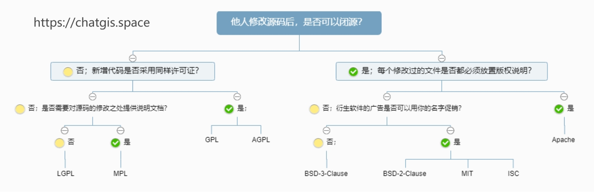

摘要：在开源技术蓬勃发展的当下，理解常用开源许可，掌握GIS常用技术栈的许可范围，对GIS开发者、技术爱好者以及相关行业从业者意义重大。开源许可不仅保障了代码创作者的权益，还为GIS技术的广泛应用和创新提供了规则与自由。
<!--more-->
## 1. 开源许可的必要性
对于代码提供者而言，若不声明开源许可证，就相当于保留了版权。这意味着即便项目已开源，使用者仅能查看源代码，却无法实际使用，极大地阻碍了项目的共享与发展。  
从使用者角度出发，依据许可证，能清晰界定被许可的使用范围，有效避免因许可不明引发的侵权行为。

## 2. 常用许可整理
世界上的开源许可证（Open Source License）大概有上百种，本文仅介绍常见的几种许可类型，并结合阮一峰的图片内容进行了拓展。  
 
### 2.1. MIT
**MIT 许可被公认为是最为宽松的开源许可协议之一**，源自麻省理工学院（Massachusetts Institute of Technology, MIT），又称X11协议。这个协议唯一的条件就是在修改后的代码或者发行包包含原作者的许可信息。因为其宽松的许可条件，MIT许可证成为了目前最受欢迎的开源代码许可证，开源社区很多优秀技术都是采用的MIT许可。
### 2.2. BSD
BSD许可证原来是用在加州大学伯克利分校发表各个4.4BSD版本上面的，后来逐渐沿用下来了。BSD 是 “Berkeley Software Distribution” 的缩写，意为 “伯克利软件发行版”。
需要注意的是，**BSD本身并不是一个协议**，而是由五个协议组成，分别是 0-Clause、1-Clause、2-Clause、3-Clause、4-Clause ，前面的数字代表限制条款的数目。在这五个协议中，目前 4-Clause 和 1-Clause 已不再使用，0-Clause 则演变成了公共领域协议（Public Domain License），该协议甚至不要求保留作者信息。
使用BSD 3-Clause的项目有以下要求:
1.如果是开源项目派生，源代码中必须包含原项目中的BSD协议；
2.如果是闭源项目派生，比如二进制类库或商业软件，在软件的文档和版权声明中要包含原项目中的BSD协议；
3.不论开源或闭源项目派生，不可以用BSD项目作业、机构或项目产品名称做市场推广；
BSD-2-Clause与BSD-3-Clause的最大区别就是没有上面的第三条条款限制。
### 2.3. Apache
Apache 许可证是由 Apache 软件基金会发布的自由软件许可证，最新版本为 “Version 2”，即 Apache-2.0。它是一款宽松的开源许可证，允许用户自由地将基于该许可证的软件用于商业或非商业目的，自由使用、修改与分发，在分发时仅需保留原代码版权声明。由于许可允许基于该产品衍生的其他产品可以闭源，因此采用 Apache-2.0 许可证的产品适用于商业软件的开发。
需要注意的是，如果你修改了源码，要有对应的修改声明。
### 2.4. GPL
GPL全称 GNU 通用公共许可证（GNU General Public License），由自由软件基金会（Free Software Foundation, FSF）的理查德・斯托曼为 GNU 项目编写，是最为知名的开源 License。GPL 具有 “强传染性”，任何项目只要使用了 GPL 协议的代码，该项目自身就必须开源，并且要遵守 GPL 协议。Linux 采用了 GPL，这就是我们能够免费使用各种 Linux 系统的原因，其中既包括商业公司的 Linux 发行版。
### 2.5. AGPL
为了Copyleft条款能应用于在网络上运行的应用程式（如Web应用），从而避免有人以应用服务提供商方式逃避GNU通用公众特许条款；
如果软件通过网络作为服务提供给用户，服务提供者必须提供软件的源代码。
### 2.6. LGPL
LGPL，即 GNU 宽通用公共许可证（GNU Lesser General Public License），最初名为 Library GPL，是 GPL 的演进版本。其诞生主要是为了解决 GPL 的 “强传染性” 问题。在实际应用中，由于其独特的许可性质，一般采用这种许可的本身就是第三方库。与 GPL 不同，LGPL 允许商业软件通过类库引用（link）方式使用 LGPL 类库，且无需开源自身代码。这一特性使得 LGPL 在商业软件与开源类库的结合使用上，提供了更灵活的选择。
### 2.7. MPL
MPL（Mozilla Public License）由 Mozilla 基金会开放和维护，当前最新版本是 2.0，也就是 MPL-2.0 。它具备一项对商业项目极为友好的特性：企业能够在自有源代码库上添加一个接口，其中只有接口程序的源代码需依照 MPL 许可证的要求对外许可，而其他源代码无需受 MPL 许可证的约束来强制对外许可。这一特性赋予了 MPL 对商业项目一定的包容空间，也正因如此，MPL 被称为弱 copyleft。
### 2.8. EPL
EPL（Eclipse Public License）分为EPL-1.0和EPL-2.0两个版本，其中EPL-1.0如今基本已被废弃。EPL属于弱copyleft许可证，其“传染性”相对较弱。一般而言，当链接或调用EPL程序时，不会引发“传染”效应，相关项目仍可采用闭源形式。不过，若对EPL程序进行了修改，那么在分发时，就必须依据EPL的要求公开源代码。 
### 2.9. ISC
IS（CInternet Systems Consortium） 和 MIT 许可协议极为相似，都是宽松的开源许可证。
## 3. Copyleft著佐权
> 著佐权（Copyleft）是一个由自由软件运动所发展的概念，是一种利用现有著作权体制来保护所有用户和二次开发者的自由的授权方式。在自由软件授权方式中增加著佐权条款之后，该自由软件除了允许使用者自由使用、散布、修改之外，著佐权许可证更要求使用者修改后的衍生作品必须要以同等的授权方式释出以回馈社会。

1983年，自由软件（Free Software）运动的先驱、精神领袖理查德·斯托曼（Richard Matthew Stallman）决心要开发一个完全自由的、与Unix完全兼容但功能更强大的操作系统，以便为所有的计算机使用者提供一个功能齐全、性能良好的基本系统，为了把这个系统和UNIX区分开来，他巧妙地采用程序开发中常用的“递归”方式把它定义为GNU，即：GNU’s Not Unix。后因自由软件拥护者对GNU系统的发展和积累，GNU已经成为开发各种自由软件项目的代名词。
GNU项目宗旨是自由的分享软件，给予所有用户自由的复制、修改和重新发布GNU软件的权力，为了实现这一目的，就在GNU计划的宣言中，斯托曼创造了Copyleft这个词。
Copyleft不同于传统的公共领域（public domain）。**因为公共领域的作品，任何使用者虽然都可以使用，但可以不回馈变成已用**；而Copyleft作品的使用者若在发布的时候不按Copyleft的许可证要求保持同样的授权条款，并将更改的版本回馈社群的话，就是违反著作权法的侵权行为。
### 3.1. 强copyleft
GPL、AGPL
### 3.2. 弱copyleft
LGPL、MPL、EPL
### 3.3. 非copyleft
MIT、BSD、Apache、ISC

综上，强著佐权开源许可严格要求基于该开源项目的衍生作品也必须开源，这更好地体现了互联网精神，促进代码的共享与协作。而宽松型开源许可，对使用者的限制较少，允许公司将开源代码封装在自己的产品中使用，即便产品是闭源的也不受影响，因此，宽松型开源许可更深受商业公司的喜爱。
## 4. 常用技术栈的许可
### 4.1. GIS相关
| 平台  | 许可  |
| --- | --- |
| OpenLayers | BSD-2-Clause |
| Leaflet | BSD-2-Clause |
| maplibre-gl | BSD-3-Clause |
| @antv/l7 | MIT |
| @turf/turf | MIT |
| jsts | (EDL-1.0 OR EPL-1.0) |
| Cesium | Apache-2.0 |
| three | MIT |

### 4.2. 前端相关
| 平台  | 许可  |
| --- | --- |
| typescript | Apache-2.0 |
| vue | MIT |
| react | MIT |
| vite | MIT |
| element-plus | MIT |
| vue-router | MIT |
| pinia | MIT |

## 5. 参考资料

- [开源许可证教程-阮一峰](https://www.ruanyifeng.com/blog/2017/10/open-source-license-tutorial.html)
- [选择一个开源许可证](https://choosealicense.rustwiki.org/)
- [各种开源协议介绍](https://www.runoob.com/w3cnote/open-source-license.html)
- [常见的开源软件许可证(License)](https://www.cnblogs.com/shenStudy/p/17744662.html)
- [著佐权-百度百科](https://baike.baidu.com/item/%E8%91%97%E4%BD%90%E6%9D%83/3339812)