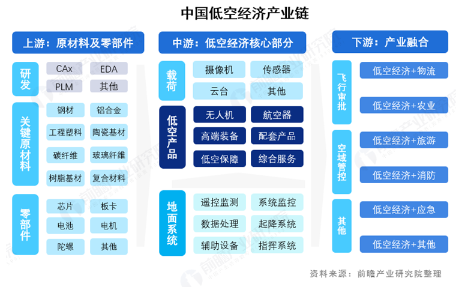
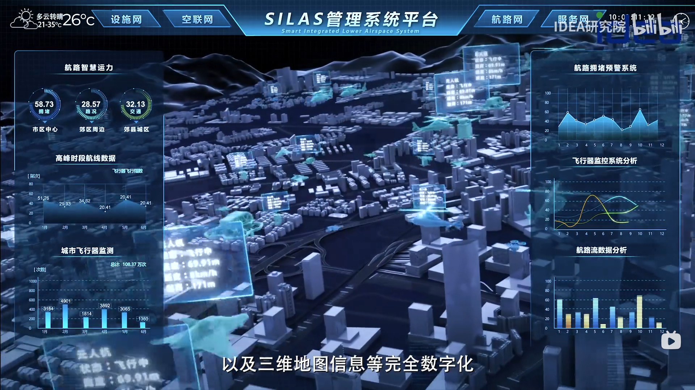
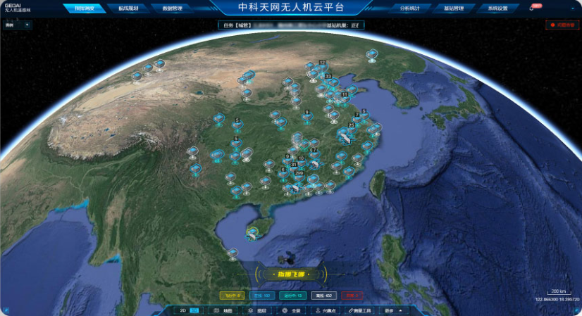
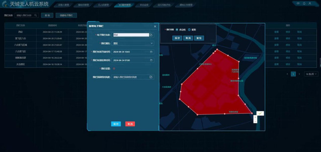

## 1. 什么是低空经济
### 1.1. 概念
低空经济是指在**垂直高度1000米以下、根据实际需要延伸至不超过3000米**的低空空域范围内，以**民用有人驾驶和无人驾驶航空器**为载体，以**载人、载货及其他作业**等多场景低空飞行活动为牵引，带动相关领域融合发展的**综合性经济业态**。
<!--more-->
### 1.2. 发展趋势
- 2021年2月，中共中央、国务院印发《国家综合立体交通网规划纲要》，提出“发展交通运输平台经济、枢纽经济、通道经济、低空经济”，首次将“低空经济”概念写入国家规划。
- 2023年12月，中央经济工作会议明确提出“打造生物制造、商业航天、低空经济等若干战略性新兴产业”。
- 2024年3月全国两会《政府工作报告》再次强调“积极打造生物制造、商业航天、低空经济等新增长引擎”，“低空经济”首次被写入政府工作报告，并被纳入新质生产力的范畴。
- 2024年7月,《中共中央关于进一步全面深化改革、推进中国式现代化的决定》明确指出“发展通用航空和低空经济”。
- 2024年12月25 日，国务院办公厅印发《关于优化完善地方政府专项债券
管理机制的意见》，《意见》提出7方面17 项举措，其中明确了，地方政府专项债券可用作项目资本金的行业中，包括低空经济等新兴产业基础设施。
- 2024年12月27日，国家发展改革委低空经济发展司正式亮相。其具体职责是:拟订并组织实施低空经济发展战略、中长期发展规划，提出有关政策建议，协调有关重大问题等。
- 广东省人民政府办公厅印发了《广东省推动低空经济高质量发展行动方案(2024-2026年)》，计划三年内打造世界领先的低空经济产业高地。
- 北京市人民政府经信局发布《北京市促进低空经济产业高质量发展行动方案(2024-2027年)(征求意见稿)》，力争通过三年时间，实现北京低空经济相关企业数量突破5000家。
### 1.3. 产业构成
低空经济主要由低空制造产业、低空飞行产业、低空保障产业和综合服务产业构成。
- 低空制造产业是指航空器的研发制造类产业，主要包括各种有人驾驶和无人驾驶航空器及其零部件和机载设备的研发、制造、销售、进出口等产业；
- 低空飞行产业是低空经济的核心产业，对整个低空经济发展发挥牵引和带动作用，主要由生产作业类、公共服务类、航空消费类等产业构成；
- 低空保障产业是指为空域安全和低空飞行提供服务保障的各类产业，主要包括低空空域管控系统、通用机场、飞行营地、直升机起降点、飞行服务站、无人机飞行信息系统、无人机反制系统以及通讯、导航、气象、油料、维修等相关产业；
- 综合服务产业是指支持和辅助低空经济发展的各类地面服务性产业，主要包括相关航空会展、教育、传媒、科普、信息、租赁保险、中介代理等产业。
### 1.4. 产业分类
中国低空经济产业链上游为原材料与核心零部件领域，研发包括各种工业软件，原材料包括钢材、铝合金、高分子材料等，零部件包括芯片、电池、电机等；
产业链中游包含无人机、航空器、高端装备、配套产品、低空保障与综合服务；
衔接下游需要有飞行审批、空域备案等，通过后的下游应用是低空经济与各种产业的融合。

## 2. GIS参与低空经济
### 2.1. 地理数据
- 二维地图数据
- 地形地貌数据
- 建筑物建模
### 2.2. 三维可视化
- 机场
- 起降点
- 飞行态势
- 空域标绘
- 数字航路
### 2.3. 空间分析
- 航路规划
- 区域规划
- 空域监管
- 要地安防
- 避障分析
- 机场跑道入侵
- 时空碰撞检测
- 电子围栏预警告警
### 2.4. 流程审批
- 飞行计划申请审批
- 空域申请审批

在低空经济的产业构成中，GIS（地理信息系统）的应用范围极为广泛，**几乎覆盖了各个产业领域**；特别是在低空保障产业中，GIS 能够深度嵌入无人机飞行信息系统、导航等细分产业中并加以应用。
低空经济数字化平台的核心在于三维场景的空间分析，然而目前，绝大多数低空经济系统主要侧重于展示、管理等方面，在**核心的三维场景空间分析上着力不足** 。 
## 3. 低空经济平台案例
- [智能融合低空系统（SILAS）](https://www.bilibili.com/video/BV1wQ4y1G779)

- [中科天网无人机云平台](https://www.geoai.com/zktw-UAV)
  
- 天城无人机云系统
南航自主研发的“天城无人机云系统” 顺利通过民航局现场审查。

## 参考资料
1. [低空智联网技术体系白皮书-中国移动](http://doc.cserver.com.cn/doc_d597065f-10a0-43c4-b2f4-36fc3ed4f5cd.html)
2. [重磅！前瞻产业研究院发布《2024年中国低空经济报告》](https://f.qianzhan.com/aboutus/detail/231226-68eadbf7.html)
3. [低空经济发展报告（2024-2025）-2025年2月28日](https://mp.weixin.qq.com/s/z00YTcADTRNXxnvirUbwBA)
4. [“天城无人机云系统” 顺利通过民航局现场审查 - 南京航空航天大学](https://gjcxg.nuaa.edu.cn/2024/0429/c16954a337672/page.htm)

