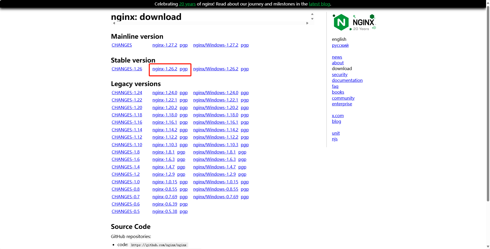

本文详细讲解Linux离线环境下Nginx安装，涵盖安装包获取、依赖处理、编译配置及启动全流程，助力轻松完成部署。 
<!-- more -->
## 1. 下载解压
### 1.1. 下载 
下载地址：https://nginx.org/en/download.html

在Stable version模块下载最新的稳定版本，下载文件`nginx-1.26.2.tar.gz`;



### 1.2. 解压
将安装包上传到主机服务器，并解压
```
# 解压命令
tar -xvf nginx-1.26.2.tar.gz
````
说明：此处解压的文件夹是安装包文件，不是安装后要使用的文件夹。

```shell
drwxr-xr-x 6 gis gis   4096 Nov 11 14:12 auto
-rw-r--r-- 1 gis gis 327851 Aug 13 00:39 CHANGES
-rw-r--r-- 1 gis gis 501527 Aug 13 00:39 CHANGES.ru
drwxr-xr-x 2 gis gis   4096 Nov 11 14:12 conf
-rwxr-xr-x 1 gis gis   2611 Aug 12 22:28 configure
drwxr-xr-x 4 gis gis   4096 Nov 11 14:12 contrib
drwxr-xr-x 2 gis gis   4096 Nov 11 17:11 html
-rw-r--r-- 1 gis gis   1397 Aug 12 22:28 LICENSE
-rw-rw-r-- 1 gis gis    414 Nov 11 14:29 Makefile
drwxr-xr-x 2 gis gis   4096 Nov 11 14:12 man
drwxrwxr-x 3 gis gis   4096 Nov 11 16:30 objs
-rw-r--r-- 1 gis gis     49 Aug 12 22:28 README
drwxr-xr-x 9 gis gis   4096 Aug 13 00:39 src
```

- auto目录：用于编译时的文件，以及相关lib库，编译时对对操作系统的判断等，都是为了辅助./configure命令执行的辅助文件；
- CHANGES文件：就是当前版本的说明信息，比如新增的功能，修复的bug，变更的功能等；
- CHANGES.ru文件：作者是俄罗斯人，生成了一份俄罗斯语言的CHANGE文件；
- conf目录：是nginx编译安装后的默认配置文件或者示列文件，安装时会拷贝到安装的文件夹里面；
- configure文件：编译安装前的预备执行文件；
- contrib目录：该目录是为了方便vim编码nginx的配置文件时候，颜色突出显示，可以将该目录拷贝到自己的~/.vim目录下面
- html目录：编译安装的默认的2个标准web页面，安装后会自动拷贝到nginx的安装目录下的html下；
- Makefile文件：nginx所需的所有指令和依赖关系；
- man目录：nginx命令的帮助文档，linux上可以使用man命令查看帮助；
- src：nginx的源码文件；

## 2. 配置编译环境
在安装包文件夹执行`configure`命令，使用该命令可以用来配置nginx编译环境。
### 2.1. 命令执行
```
./configure
```
- 该命令检查系统相关功能是否具备并生成`objs/Makefile`文件;
- 显示使用`system PCRE library`和`system zlib library`;
- 显示后续安装的配置信息，比如安装目录`nginx path prefix`，默认为`/usr/local/nginx`;

命令执行日志：
```
checking for OS
 + Linux 4.19.12-1.el7.elrepo.x86_64 x86_64
checking for C compiler ... found
 + using GNU C compiler
 + gcc version: 4.8.5 20150623 (Red Hat 4.8.5-36) (GCC) 
checking for gcc -pipe switch ... found
checking for -Wl,-E switch ... found
checking for gcc builtin atomic operations ... found
checking for C99 variadic macros ... found
checking for gcc variadic macros ... found
checking for gcc builtin 64 bit byteswap ... found
checking for unistd.h ... found
... ...
... ...
checking for getaddrinfo() ... found
checking for PCRE2 library ... not found
checking for PCRE library ... found
checking for PCRE JIT support ... found
checking for zlib library ... found
creating objs/Makefile

Configuration summary
  + using system PCRE library
  + OpenSSL library is not used
  + using system zlib library

  nginx path prefix: "/usr/local/nginx"
  nginx binary file: "/usr/local/nginx/sbin/nginx"
  nginx modules path: "/usr/local/nginx/modules"
  nginx configuration prefix: "/usr/local/nginx/conf"
  nginx configuration file: "/usr/local/nginx/conf/nginx.conf"
  nginx pid file: "/usr/local/nginx/logs/nginx.pid"
  nginx error log file: "/usr/local/nginx/logs/error.log"
  nginx http access log file: "/usr/local/nginx/logs/access.log"
  nginx http client request body temporary files: "client_body_temp"
  nginx http proxy temporary files: "proxy_temp"
  nginx http fastcgi temporary files: "fastcgi_temp"
  nginx http uwsgi temporary files: "uwsgi_temp"
  nginx http scgi temporary files: "scgi_temp"
```

### 2.2. 修改安装目录
查看帮助，可以查看到可配置项
``` shell
./configure --help
```
例如：修改安装目录

``` shell
./configure --prefix='/gis/nginx'
```

### 2.3. 核心库PCRE和zlib
根据配置检查结果可知，PCRE和zlib是Nginx两个核心库。

 PCRE(Perl Compatible Regular Expressions   perl语言兼容正则表达式)是一个用C语言编写的正则表达式函数库。在Nginx的配置文件nginx.conf中，经常会使用正则表达式来定义URL匹配规则、重写规则等，PCRE库就是Nginx用来解析正则表达式的工具。
 
zlib 是提供数据压缩用的函式库，Nginx的某些模块需要用到数据压缩和解压缩功能。

 如果系统不具备这些库，还需要自行安装。

## 3. 编译安装
### 3.1. make
**作用：** `make` 命令是用来编译源代码的。  
在 nginx 的上下文中，当你下载了 nginx 的源代码包并解压后，会看到一个 Makefile 文件，这个 Makefile 文件包含了编译 nginx 所需的所有指令和依赖关系，运行 make 命令会读取这个 Makefile，然后根据系统环境和配置选项（通过之前的 `./configure` 命令设置）来编译 nginx 的源代码。
**过程：** `make` 命令会调用编译器（如 gcc）来编译 nginx 的 C 源代码文件，生成目标文件（通常是 .o 文件），并最终链接这些目标文件生成可执行文件（如 nginx 二进制文件）。
**执行：** 执行命令`make`，没有报错就代表执行成功；
执行日志
```
make -f objs/Makefile
make[1]: Entering directory `/gis/nginx1.26.2/nginx-1.26.2-source'
cc -c -pipe  -O -W -Wall -Wpointer-arith -Wno-unused-parameter -Werror -g  -I src/core -I src/event -I src/event/modules -I src/event/quic -I src/os/unix -I objs \
        -o objs/src/core/nginx.o \
        src/core/nginx.c
...
...
src/http/modules \
        -o objs/src/http/modules/ngx_http_upstream_zone_module.o \
        src/http/modules/ngx_http_upstream_zone_module.c
cc -c -pipe  -O -W -Wall -Wpointer-arith -Wno-unused-parameter -Werror -g  -I src/core -I src/event -I src/event/modules -I src/event/quic -I src/os/unix -I objs \
        -o objs/ngx_modules.o \
        objs/ngx_modules.c
cc -o objs/nginx \
objs/src/core/nginx.o \
...
...
objs/ngx_modules.o \
-ldl -lpthread -lcrypt -lpcre -lz \
-Wl,-E
sed -e "s|%%PREFIX%%|/gis/nginx|" \
        -e "s|%%PID_PATH%%|/gis/nginx/logs/nginx.pid|" \
        -e "s|%%CONF_PATH%%|/gis/nginx/conf/nginx.conf|" \
        -e "s|%%ERROR_LOG_PATH%%|/gis/nginx/logs/error.log|" \
        < man/nginx.8 > objs/nginx.8
make[1]: Leaving directory `/gis/nginx1.26.2/nginx-1.26.2-source'
```


### 3.2. make install
**作用：** `make install` 命令是用来安装编译好的 nginx 可执行文件及其相关文件（如配置文件、日志文件目录等）到指定的目录中，这个命令也是根据 Makefile 中的指令来执行的，但它关注的是安装步骤，而不是编译步骤。
**过程：** `make install` 会将 nginx 二进制文件、配置文件模板、HTML 文档目录等复制到你在 `./configure` 步骤中指定的目录（如 /usr/local/nginx）。这个步骤还包括设置必要的权限和创建日志文件目录等。

```
make -f objs/Makefile install
make[1]: Entering directory `/gis/nginx1.26.2/nginx-1.26.2-source'
test -d '/gis/nginx' || mkdir -p '/gis/nginx'
test -d '/gis/nginx/sbin' \
        || mkdir -p '/gis/nginx/sbin'
test ! -f '/gis/nginx/sbin/nginx' \
        || mv '/gis/nginx/sbin/nginx' \
                '/gis/nginx/sbin/nginx.old'
cp objs/nginx '/gis/nginx/sbin/nginx'
test -d '/gis/nginx/conf' \
        || mkdir -p '/gis/nginx/conf'
cp conf/koi-win '/gis/nginx/conf'
cp conf/koi-utf '/gis/nginx/conf'
cp conf/win-utf '/gis/nginx/conf'
test -f '/gis/nginx/conf/mime.types' \
        || cp conf/mime.types '/gis/nginx/conf'
cp conf/mime.types '/gis/nginx/conf/mime.types.default'
test -f '/gis/nginx/conf/fastcgi_params' \
        || cp conf/fastcgi_params '/gis/nginx/conf'
cp conf/fastcgi_params \
        '/gis/nginx/conf/fastcgi_params.default'
test -f '/gis/nginx/conf/fastcgi.conf' \
        || cp conf/fastcgi.conf '/gis/nginx/conf'
cp conf/fastcgi.conf '/gis/nginx/conf/fastcgi.conf.default'
test -f '/gis/nginx/conf/uwsgi_params' \
        || cp conf/uwsgi_params '/gis/nginx/conf'
cp conf/uwsgi_params \
        '/gis/nginx/conf/uwsgi_params.default'
test -f '/gis/nginx/conf/scgi_params' \
        || cp conf/scgi_params '/gis/nginx/conf'
cp conf/scgi_params \
        '/gis/nginx/conf/scgi_params.default'
test -f '/gis/nginx/conf/nginx.conf' \
        || cp conf/nginx.conf '/gis/nginx/conf/nginx.conf'
cp conf/nginx.conf '/gis/nginx/conf/nginx.conf.default'
test -d '/gis/nginx/logs' \
        || mkdir -p '/gis/nginx/logs'
test -d '/gis/nginx/logs' \
        || mkdir -p '/gis/nginx/logs'
test -d '/gis/nginx/html' \
        || cp -R html '/gis/nginx'
test -d '/gis/nginx/logs' \
        || mkdir -p '/gis/nginx/logs'
make[1]: Leaving directory `/gis/nginx1.26.2/nginx-1.26.2-source'
```

## 4. 启动测试
### 4.1. 启动
修改端口，一般不会使用默认的80端口，需要自行修改；
在安装目录下conf中nginx.conf中直接修改端口；

运行安装目录sbin下面的nginx即可
```
./nginx
```
查看版本
```
./nginx -v
```
nginx version: nginx/1.26.2

### 4.2. 测试
输入主机ip和端口好，出现`Welcom to nginx!`页面，则表示成功安装并启动。
