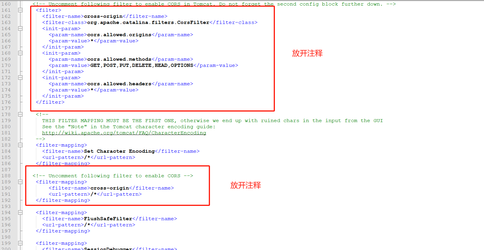

本文聚焦 Linux 环境，结合 Tomcat 服务器，全面解析 GeoServer 部署流程，从环境准备到部署调试，助你快速搭建地理信息服务平台。
<!-- more -->
## 1. 准备工作
### 1.1. 版本对应
- GeoServer对应Java版本要求，见[官网](https://docs.geoserver.org/latest/en/user/installation/index.html#installation)；
- Java与Tomcat版本对应，见[官网](https://tomcat.apache.org/whichversion.html)；
- 版本选择
  GeoServer当前最新稳定版本2.27.0，考虑到Java11更稳定，选择java11，最新版本为11.0.27；但是，在以往的实践操作Tomcat10发布GeoServer后浏览器无法访问到管理页面，更换为9可以，因此Tomcat选择9版本，最新为9.0.104。
### 1.2. 下载软件
**下载地址：**
- GeoServer下载，  见[官网](https://geoserver.org/download/)；
- Tomcat下载，见[官网](https://tomcat.apache.org/download-90.cgi)；
- Java下载需要登录用户，见[官网](https://www.oracle.com/java/technologies/downloads/#java11)；
**下载列表**
  - geoserver-2.27.0-war.zip
  - jdk-11.0.27_linux-x64_bin.tar.gz
  - apache-tomcat-9.0.104.zip
## 2. 部署步骤
### 2.1. Java配置
将下载的JDK压缩包上传到Linux主机上，解压到指定目录；
```
tar -zxvf jdk-11.0.11_linux-x64_bin.tar.gz -C /usr/local/
```

### 2.2. Tomcat设置
- 关联Java
设置tomcat → bin → setclasspath.sh，开始处添加以下内容：
```
JAVA_HOME=/name/jdk-11.0.20
JRE_HOME=/name/jdk-11.0.20
```
- 修改端口号
  一般部署不会使用默认端口8080，所以，需要在`conf` → `server.xml`文件中修改；
  ```xml
      <Connector port="8080" protocol="HTTP/1.1"
               connectionTimeout="20000"
               redirectPort="8443"
               maxParameterCount="1000"
               />
  ```
- 删除无用文件
基于安全考虑，需要删除webapp下tomcat自带的所有文件夹，只保留geosever。

将GeoServer.war放在tomcat的webapp下，启动Tomcat，浏览器访问http://SERVER/geoserver 。例如，当 Tomcat 在本地主机上的端口 8080 上运行时，URL 将是 `http://localhost:8080/geoserver`

## 3. GeoServer配置
### 3.1. 关联MySQL数据库
参考[官方说明](https://docs.geoserver.org/stable/en/user/data/database/mysql.html#mysql)；在官网下载Mysql相关Jar包，将jar包丢到`/webapps/geoserver/WEB-INF/lib`，重启服务即可。

### 3.2. 设置允许跨域
文件位置：`/webapps/geoserver/WEB-INF/web.xml`；  
放开该文件中跨域注释;


### 3.3. 改成强密码
基于安全考虑，修改默认密码（新版本不改密码主页会有对应提醒）

