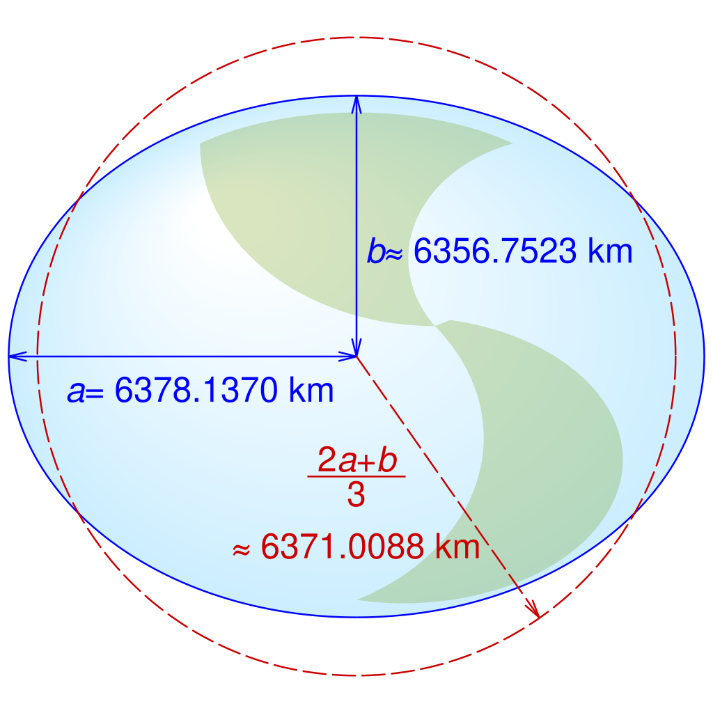

由于地球的自转、内部密度的不均匀以及外部的潮汐力使得地球的形状偏离完美的球形。同时局部的地势增大了这种不均匀性，使得地球的表面状况极度复杂。为了更好的描述地球，我们通常会使用**赤道半径、极半径和平均半径**三个核心概念。
<!-- more -->
## 1. 半径数据
|参数类型|定义|数值|
|--|--|--|
|赤道半径|地球中心到赤道的距离|6,378.1370千米|
|极半径|地球中心到两极的距离|6,356.7523千米|
|平均半径|赤道半径与极半径的几何平均|6,371.0088千米|

## 2. 半径说明
现代测量通过卫星技术（如 GPS、GRACE）实现高精度测算，赤道半径和极半径的数值精度可达米级甚至厘米级，所以赤道半径和极半径的确定值。
### 2.1. 赤道半径（Equatorial Radius）
- 定义：地球中心到赤道表面的距离，是地球最 “宽” 处的半径；
- 数值：约 6,378.137 千米；
- 特点：由于地球自转产生的离心力，赤道区域向外凸起，因此赤道半径比极半径长约 21 千米；
- 应用场景：用于描述地球赤道附近的地理或天文计算（如赤道周长、低纬度地区的曲率）；
### 2.2. 极半径（Polar Radius）
- 定义：地球中心到北极或南极表面的距离，是地球最 “扁” 处的半径；
- 数值：约 6,356.7523 千米；
- 特点：两极因地球自转的离心力影响而稍扁，极半径比赤道半径短；
- 应用场景：用于极地地区的地理测量或地球动力学研究（如极移、地轴倾斜影响）；
### 2.3. 平均半径（Mean Radius）
- 定义：地球的三维平均半径，是赤道半径和极半径的几何平均值，用于简化计算；
- 数值：6371.0088 千米；
- 计算公式：（2a + b）/ 3，其中，a为赤道半径，b为极半径；
- 特点：忽略地球形状的细微差异，将地球近似为完美球体时使用；
- 应用场景：通用地理计算（如地球体积、表面积）、天文轨道计算（如卫星环绕半径）；
## 3. 地球周长
### 3.1. 赤道周长
- 计算原理：基于赤道半径（6378.137 千米），套用圆周长公式 `C=2πr`，可得出周长为40075 千米；
- 实际意义：赤道地区地球自转线速度达 1670 千米 / 小时，因此航天器从赤道附近发射可借助 “离心力” 节省燃料。

### 3.2. 子午线周长
- 计算原理：以极半径（6356.7523 千米）为基准，结合椭球体公式计算，结果约为 40008 千米。
- 特殊单位：历史上，科学家曾将子午线周长的 四千万分之一定义为 1 米（米制起源），这一标准推动了全球度量衡统一。

## 4. 长度单位“米”
国际单位制的长度单位 “米”（meter）起源于法国，为了报证精度，其间历经多次科学迭代，
### 4.1. 起源：以地球子午线为基准（1790-1799 年）
1790 年，法国科学家提议以通过巴黎的**地球子午线全长的四千万分之一**作为 “米” 的定义，1791 年获法国国会批准。
1792-1799 年，法国天文学家完成对敦克尔克至巴塞罗那的子午线测量，据此制成一根铂杆，以杆两端距离定为1 米，称 “档案米”，存于法国档案局。
### 4.2. 迭代：铂铱合金米原器（1872-1960 年）
因 “档案米” 变形严重，1872 年改用铂铱合金（90% 铂 + 10% 铱）制造 31 只米原器（截面 X 形），刻线精度达 6-8 微米。
1889 年国际计量大会选定第 6 号米原器为国际米原器，规定0℃、1 标准大气压下，两端刻线间距为 1 米，副尺分发各国。
1927 年进一步规范保存条件（如水平放置、恒温恒压）。
### 4.3. 革新：基于光波波长的自然基准（1960-1983 年）
米原器存在材料变形、复制精度有限等问题，20 世纪 50 年代后，科学家采用氪 - 86 同位素光谱线波长作为长度基准（中国于 1963 年建立此基准），精度达 0.1 微米，稳定性远超实物基准。
### 4.4. 现代定义：以光速为基准（1983 年至今）
1983 年第十七届国际计量大会重新定义 “米”：
米是光在真空中 1/299792458 秒内行进的距离。
这一定义基于恒定物理常数（光速 c=299792458m/s），精度达纳米级，彻底摆脱对实物基准的依赖，沿用至今。

米定义过程：地球子午线（自然长度）→ 实物基准（米原器）→ 原子光谱（稳定波长）→ 物理常数（光速），这一历程体现了人类对 “精准度量” 的追求，从依赖地球到依托宇宙基本规律，标志着计量科学的飞跃。
